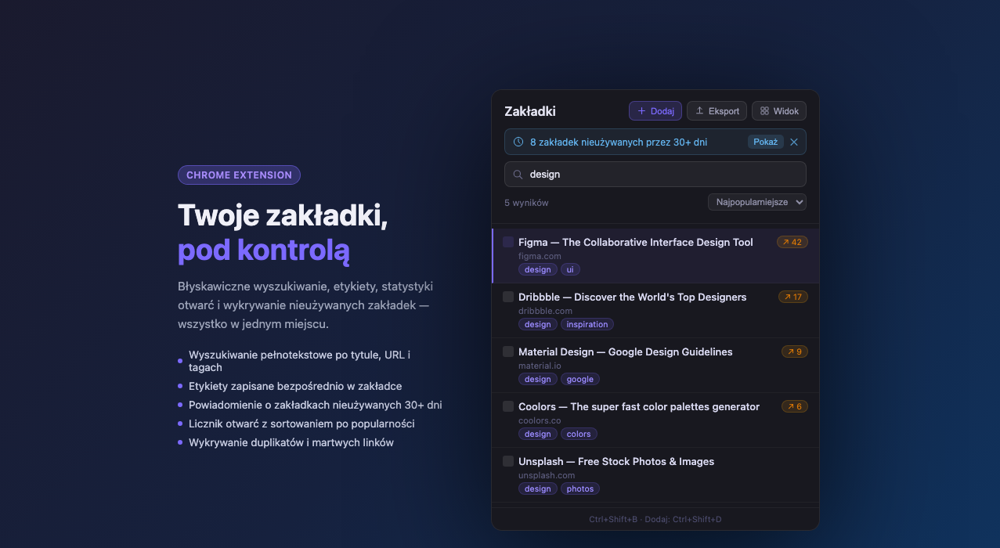
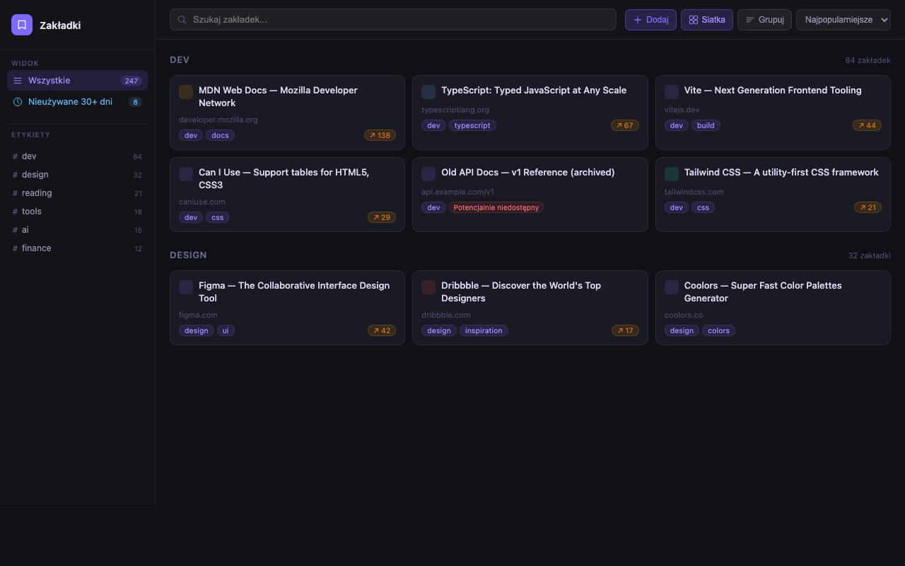

<p align="center">
  
</p>

<h1 align="center">Bookmarks Manager</h1>

<p align="center">
  Prywatny menedżer zakładek Chrome z wyszukiwaniem, etykietami, statystykami otwarć i opcjonalnym AI.<br>
  Bez kont, bez chmury, bez reklam.
</p>

<p align="center">
  <a href="https://cezarysanecki.github.io/chrome-bookmarks-manager/">🌐 Strona projektu</a>
</p>

---

<p align="center">
  
  
</p>

---

## Instalacja

**Ze sklepu Chrome** *(zalecane)*
Wejdź na stronę rozszerzenia w Chrome Web Store i kliknij **Dodaj do Chrome**.

**Ręcznie (tryb dewelopera)**
1. Pobierz lub sklonuj repozytorium.
2. Otwórz Chrome i przejdź do `chrome://extensions`.
3. Włącz **Tryb dewelopera** (prawy górny róg).
4. Kliknij **Wczytaj rozpakowane** i wskaż folder z rozszerzeniem.

---

## Szybki start

| Akcja | Jak |
|---|---|
| Otwórz menedżer | Kliknij ikonę na pasku **lub** `Ctrl+Shift+B` |
| Dodaj zakładkę z aktywnej strony | `Ctrl+Shift+D` |
| Otwórz widok pełnoekranowy | Przycisk **Widok** w popupie |
| Wyszukaj zakładkę | Zacznij pisać — wyniki filtrują się w czasie rzeczywistym |

---

## Funkcje

### Wyszukiwanie
Wyszukiwanie działa na **tytule, URL i etykietach** — nie tylko od początku, ale też w środku i na końcu tekstu. Wystarczy wpisać fragment.

### Etykiety
Zakładki można oznaczać etykietami w celu grupowania tematycznego. Format w tytule:

```
Nazwa strony | etykieta1, etykieta2
```

- Kliknij ikonę **etykiety** przy zakładce, aby dodać lub usunąć etykiety.
- Kliknij etykietę na liście, aby przefiltrować wyłącznie zakładki z tą etykietą.
- W widoku pełnym lewy panel pokazuje wszystkie etykiety z liczbą zakładek.
- Pasek **Bez etykiet** w popupie pozwala szybko wyfiltrować zakładki bez żadnej etykiety.

### Statystyki otwarć i sortowanie popularności
Każde otwarcie zakładki jest zliczane. Przy zakładce widoczna jest plakietka `↗ N` z liczbą otwarć. Domyślne sortowanie **Najpopularniejsze** pokazuje najczęściej używane zakładki na górze. Dostępne opcje sortowania:

- Najpopularniejsze (domyślne)
- Domyślna kolejność (z Chrome)
- A → Z / Z → A
- Według domeny

Wybrane sortowanie jest zapamiętywane między sesjami.

### Nieużywane zakładki (30+ dni)
Rozszerzenie wykrywa zakładki, których nie otwierałeś przez ponad 30 dni. W popupie pojawia się niebieski pasek z licznikiem i przyciskiem **Pokaż** do szybkiego przejrzenia.

### Edycja i usuwanie
Najedź kursorem na zakładkę, aby zobaczyć przyciski akcji:
- **Edytuj** — zmień tytuł, URL i etykiety bezpośrednio na liście.
- **Usuń** — pojawi się okno potwierdzenia. Po usunięciu masz **6 sekund** na cofnięcie akcji przyciskiem **Cofnij** w powiadomieniu.

### Historia zmian i cofanie (Undo)
Każde usunięcie, edycja i zmiana etykiety jest rejestrowana. W widoku pełnym lewy panel zawiera sekcję **Historia** z ostatnimi operacjami — każdą można cofnąć przyciskiem `↩`.

### Kopiowanie linku
Ikona kopiowania jest zawsze widoczna przy każdej zakładce — kliknięcie natychmiast kopiuje adres URL do schowka.

### Podobne zakładki
Przycisk **Podobne** przy zakładce filtruje listę do zakładek z tej samej domeny lub o zbliżonym tytule — przydatne do odkrywania duplikatów tematycznych.

### Wykrywanie duplikatów URL
Rozszerzenie automatycznie porównuje adresy URL (ignorując `www`, parametry śledzące, kotwice `#`). Jeśli wykryje duplikaty:
- W popupie pojawi się żółty pasek z liczbą duplikatów i przyciskiem **Pokaż**.
- W widoku pełnym — pozycja **Duplikaty** w lewym panelu grupuje je do przejrzenia i usunięcia.

### Eksport i import CSV
- **Eksport** — pobiera plik `.csv` z tytułami, URL-ami i etykietami wszystkich zakładek (kompatybilny z Excel).
- **Import** — wczytuje plik `.csv` w tym samym formacie; zakładki już istniejące są pomijane.

Format kolumn: `title`, `url`, `tags` (etykiety oddzielone średnikiem).

### Widok siatki i grupowanie
W widoku pełnym dostępne są dwa przełączniki:
- **Siatka** — wyświetla zakładki jako kafelki zamiast listy.
- **Grupuj** — grupuje zakładki według etykiet w osobne sekcje.

Oba tryby można łączyć. Wybrane ustawienia są zapamiętywane między sesjami.

---

## Ustawienia (widok pełny → przycisk Ustawienia)

Ustawienia można zamknąć klawiszem `Escape`.

### Favicon przy zakładkach *(domyślnie wyłączone)*
Wyświetla ikonę domeny obok każdej zakładki na liście.

### Sprawdzanie martwych linków *(domyślnie wyłączone)*
Przy każdym otwarciu widoku pełnego rozszerzenie sprawdza dostępność wszystkich zakładek (żądania HEAD, timeout 6 s). Potencjalnie niedostępne zakładki oznaczane są plakietką **Potencjalnie niedostępny**.

> **Uwaga:** przy dużej liczbie zakładek może znacznie spowolnić działanie.

### Sugestie etykiet AI *(domyślnie wyłączone, wymaga klucza OpenAI)*
Po włączeniu i podaniu klucza API przy każdej zakładce pojawi się przycisk gwiazdki. Kliknięcie wysyła tytuł i URL do modelu **GPT-4o mini** i zwraca propozycje etykiet jako klikalne chipsy.

Klucz OpenAI przechowywany jest wyłącznie lokalnie w przeglądarce i trafia tylko do serwera OpenAI.

---

## Skróty klawiaturowe

| Skrót | Działanie |
|---|---|
| `Ctrl+Shift+B` | Otwórz/zamknij popup menedżera |
| `Ctrl+Shift+D` | Zapisz aktywną stronę jako zakładkę |
| `↑` / `↓` | Nawigacja po liście zakładek w popupie |
| `Enter` | Otwórz podświetloną zakładkę |
| `/` | Skup fokus na polu wyszukiwania (widok pełny) |
| `Escape` | Zamknij modal / ustawienia / wyczyść podświetlenie |

---

## Prywatność i bezpieczeństwo

- Wszystkie dane zakładek pozostają w Chrome — żadne informacje nie są wysyłane na zewnętrzne serwery (z wyjątkiem opcjonalnych wywołań OpenAI API, gdy funkcja AI jest włączona).
- Etykiety są przechowywane bezpośrednio w tytule zakładki Chrome — synchronizują się automatycznie między urządzeniami przez konto Google, bez dodatkowej infrastruktury.
- Historia zmian i ustawienia zapisywane są lokalnie (`chrome.storage.local`) i nie opuszczają przeglądarki.

Pełna polityka prywatności: [cezarysanecki.github.io/chrome-bookmarks-manager/#privacy](https://cezarysanecki.github.io/chrome-bookmarks-manager/#privacy)
